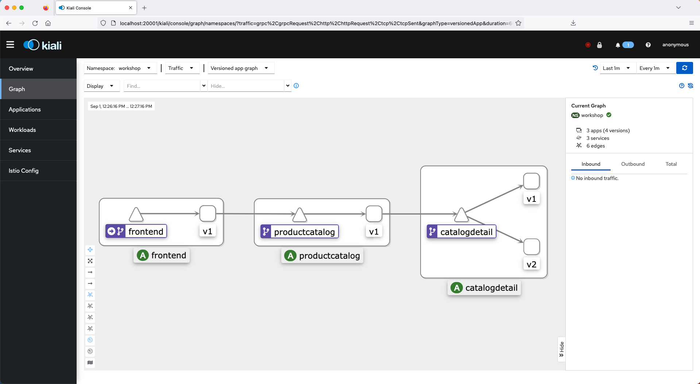

# Module 2 - Traffic Management
## Section 0 - Add mesh resources to all the services

In this step we add the Istio mesh resources to wrap the `frontend`, `productcatalog` and
`catalogdetail` services.

A [`DestinationRule`](./catalogdetail-destinationrule.yaml) is created for `catalogdetail` service to select subsets
based on the `version` label of the destination pods. However, the initial [`VirtualService`](./catalogdetail-virtualservice.yaml) definition does not specify any 
subset configuration thereby leading to a uniform traffic spread across both subsets.

### Deploy 

```bash
# Change directory to the right folder
cd ../02-traffic-management/00-add-mesh-resources

# Install the mesh resources
kubectl apply -f '*.yaml'
```

Output should be similar to:
```bash
destinationrule.networking.istio.io/catalogdetail created
virtualservice.networking.istio.io/catalogdetail created
virtualservice.networking.istio.io/frontend created
virtualservice.networking.istio.io/productcatalog created
```

### Validate

#### Istio Resources

Run the following command to list all the Istio resources created.

```bash
kubectl get Gateway,VirtualService,DestinationRule -n workshop
```

Output should be similar to:
```bash
NAME                                             AGE
gateway.networking.istio.io/productapp-gateway   25m

NAME                                                GATEWAYS                 HOSTS                AGE
virtualservice.networking.istio.io/catalogdetail                             ["catalogdetail"]    48s
virtualservice.networking.istio.io/frontend                                  ["frontend"]         48s
virtualservice.networking.istio.io/productapp       ["productapp-gateway"]   ["*"]                25m
virtualservice.networking.istio.io/productcatalog                            ["productcatalog"]   48s

NAME                                                HOST                                       AGE
destinationrule.networking.istio.io/catalogdetail   catalogdetail.workshop.svc.cluster.local   48s
```

Access the `kiali` console you previously configured in 
[Configure Kiali](../../01-getting-started/README.md#configure-kiali) and you should notice
that the `frontend`, `productcatalog` and `catalogdetail` services now show up as `VirtualService` 
nodes.



### Test

#### Generating Traffic

Use the `siege` command line tool, generate traffic to the HTTP endpoint 
`http://$ISTIO_INGRESS_URL` noted above in the deployment output by running the following
command in a separate terminal session.

```sh 
# Generate load for 2 minute, with 5 concurrent threads and with a delay of 10s
# between successive requests
siege http://$ISTIO_INGRESS_URL -c 5 -d 10 -t 2M
```

While the load is being generated access the `kiali` console you previously 
configured and you should notice the traffic to be flowing in the manner shown
below:


The traffic distribution for `catalogdetail` shows almost even (50%) split between
both `v1` and `v2` versions like before.

### Destroy